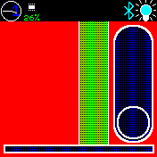

# Slider Test app

- 1: A volume slider that hides when not interacted with. It uses the
  mapping feature if draging on the slider, and the incrementing feature
  if draging just beside it.
- 2: A hidden slider that increments a preview of a change to the
  backdrop color. When the user stops interacting with it the backdrop
  is updated.
- 3: An always visible slider that controls the brightness level.
- 4: A non-interactable progressbar that follows the position in a media
  track playing on a connected android device.

A square will blink when messages with music state arrives.

Add screen shots (if possible) to the app folder and link then into this file with 

## Usage

## Features

Name the function

## Controls

Name the buttons and what they are used for

## Requests

Name who should be contacted for support/update requests

## Creator

[thyttan](https://github.com/thyttan)
